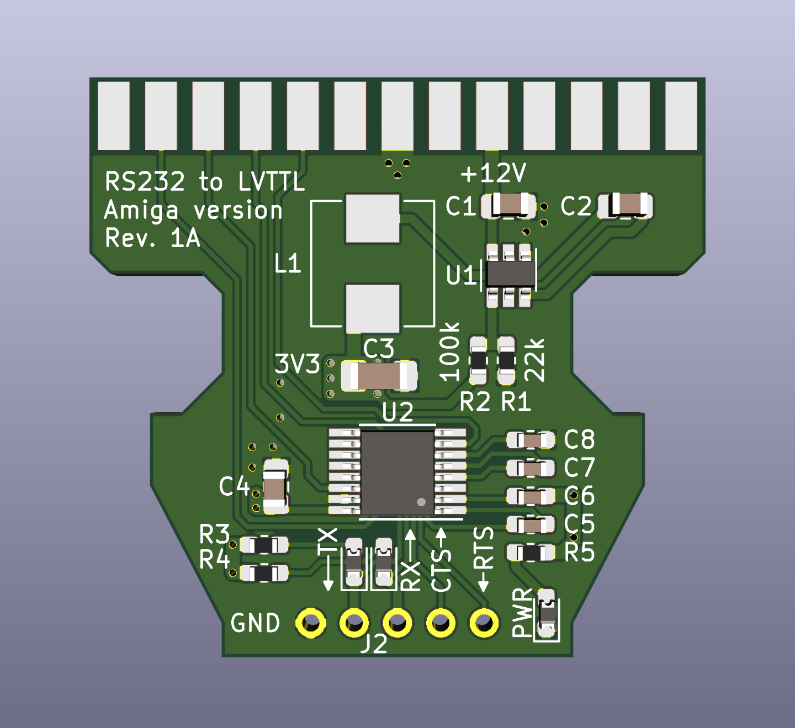
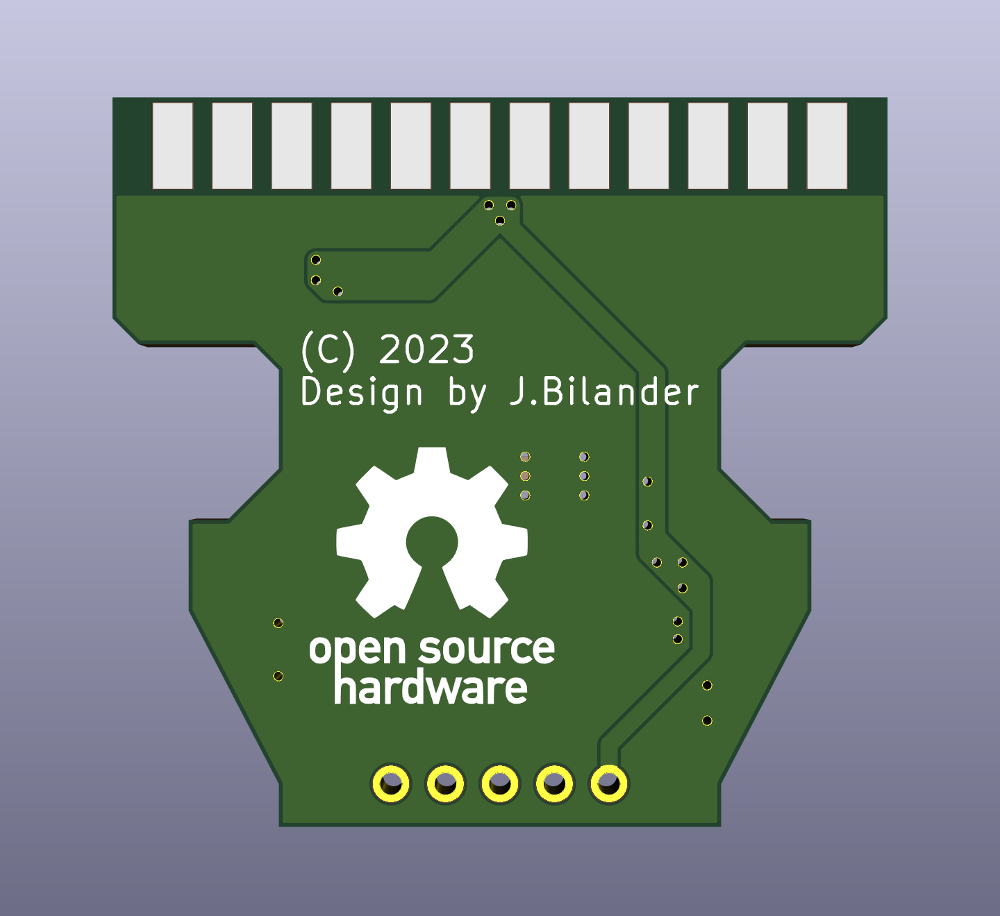

# Amiga RS232 to LVTTL adapter

Amiga RS232 to LVTTL with 3.3V Power converted and taken directly from the DB25 serial port 12V-pin (pin 9)

***
WORK IN PROGRESS, NOT TESTED/VERIFIED WORKING YET!!!
***

Revision 1A
 

 

BOM Rev. 1A
---------
Designator  | Name/Value   | Package | Notes
-|-|-|-|
U1 | TPS54308 Step-down converter | SOT-23-6 | [TPS54308DDCR](https://www.mouser.com/ProductDetail/595-TPS54308DDCR)
U2 | MAX3232 RS-232 Interface IC 3-5.5V | TSSOP-16 | [MAX3232IPWR](https://www.mouser.com/ProductDetail/595-MAX3232IPWR)
L1 | CLF7045NIT-100M-D Power Inductor, 10 uH | 7 mm x 7 mm, height 4.5 mm | [CLF7045NIT](https://www.mouser.com/ProductDetail/810-CLF7045NIT100MD)
J1 | D-Sub DB25 Female connector | EdgeMount, serial port connector solder type | [D-Sub DB25F](https://www.aliexpress.com/item/32885764031.html)
J2 | 1x05 Right-Angle Single Row Male Pin Header | Type/Color: Reverse | [PinHeader](https://www.aliexpress.com/item/32892547934.html)
R1 | Feedback Resistor 22k Ω | 0603 | [RC0603FR-0722KL](https://www.mouser.com/ProductDetail/603-RC0603FR-0722KL)
R2 | Feedback Resistor 100k Ω | 0603 | [RC0603FR-07100KL](https://www.mouser.com/ProductDetail/603-RC0603FR-07100KL) 
R3-R5 | LED Resistor 1k Ω | 0603 | [RC0603FR-071KL](https://www.mouser.com/ProductDetail/603-RC0603FR-071KL)
C1 | Capacitor 10uF | 0805 | [TMK212BBJ106KG-T](https://www.mouser.com/ProductDetail/963-TMK212BBJ106KG-T)
C2,C4 | Capacitor 0.1uF = 100nF | 0805 |
C3 | Capacitor 47uF | 1206 | [EMK316BBJ476ML-T](https://www.mouser.com/ProductDetail/963-EMK316BBJ476ML-T)
C5-C8 | Capacitor 0.1uF = 100nF | 0603 | [CL10B104KO8NNWC](https://www.mouser.com/ProductDetail/187-CL10B104KO8NNWC)
D1-D3 | SMD LED | 0603 | [SMD LED 0603](https://www.aliexpress.com/item/1005003836509392.html)

***
